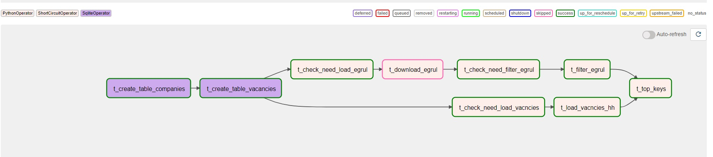
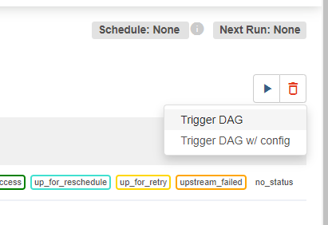

# Домашняя работа 3: Python для ETL (Князев Евгений)
Главный файл с дагом: knyazev_dag_top_sskills.py

dag_id='hwf_topskills_knyazev'

## Установка
python   v3.10.11
airflow  v2.6.3 (https://airflow.apache.org/docs/apache-airflow/stable/start.html)

Необходимые модули для python в файле requirements.txt (python -m pip install -r .\requirements.txt)

## Конфигурация и настройка
Все настроечные параметры и константы находятся в начале основного файла knyazev_dag_top_sskills.py

    OKVED_ID - Можно ограничить компании с помощью ОКВЭД до нужного уровня. 61 - Телекоммуникационные компании
    http_params['text':'text'] - Можно установить свой промт для поиска вакансии
    http_params['area':000] - Регион поиска, по умолчанию - 113 - Россия. Для Москвы - 1, Санкт-Петербург - 2

Логирование стандартное от airflow + для каждой задачи (функции) более подробное. При необходимости, в airflow.cfg установить в DEBUG.

### Соединение с БД
Для работы требуется настройка соединения в Airflow. Нужно создать соединение в Airflow со следующими параметрами:

    Connection id: sqllite_restwin  (если имя другое, то поменять DB_CONN в начале скрипта)  
    Host: /home/[restwin]/hw/hw.db (указать нужный каталог)

### Пропуск этапов:
Допускается пропуск скачивания файла, фильтрация ЕГРЮЛ и загрузку вакансий. Сделано больше для тестирования, но можно использовать.

    LOAD_EGRUL = True     # Загружать ЕГРЮЛ
    FILTER_EGRUL = True   # Фильтровать (с записью в БД)
    LOAD_VACANCIES = True # Загружать вакансии

Пример пропуска задачи LOAD_EGRUL

При этом, должны присутсвоать файлы и наполненая БД. Для чего, файл должен находиться в дирректориях, установленные параметрами:

    [в файле скрипта]:
    PATH_EGRUL = "/home/[restwin]/hw/egrul.json.zip"
    [В соеднении с БД Airflow]:
    Host: /home/[restwin]/hw/hw.db

Предзаполненная БД лежит в папке проекта, файл ЕГРЮЛ можно скачать по [ссылке](https://ofdata.ru/open-data/download/egrul.json.zip)

Удаление файла БД силами приложения не предусмотрено. Для перезапуска удалять вручную либо использовать скрипт из del_tables.py, указав место файла в DB_NAME.

## Запуск
Для запуска нужно положить файл hw_dags_knyazev в дирректорию dags airflow

dag_id='hwf_topskills_knyazev'

В даге убран автоматический запуск (@daily итп), поэтому запуск выполняется вручную (ручной тригер)

## Допущения:
1. Очистка имен компаний дает результат, но все-равно многие компании в hh.ru указывают имя не так, как в ЕГРЮЛ. Поэтому, результат не очень точный.
2. Количество вакансий органичено 100. Можно установить менее 120, потому что дальше сайт блокирует передачу и даги сорвутся.
3. Выполнение всего дага выполняется порядка 80 минут, поскольку загрузка файла ЕГРЮЛ и его фильтрация занимает много времени
4. Процесс поделен на крупные функции (Загрузка ЕГРЮЛ, фильтрация, загрузка вакансии, подсчет топа), чтобы результаты можно было нормально сохранить в БД
5. Можно было бы не делать проверки необходимости выполнения операций и проверять существование файлов, заполненых таблиц, итп. Но решил, что режим BPMN получится интереснее, когда сам можешь управлять необходимостью. С другой стороны, для продуктива лучше делать со всеми проверками.
6. Установлен ручной режим запуска, чтобы не было повторных запусков дага - неизвестно, когда будет проверка.

## Задание (справочно)
Цель работы: научиться создавать потоки работ (pipeline) ETL.
В итоговом проекту мы объединим результаты, полученные в предыдущих домашних работах, и построим единый поток работ ETL.

Задание
Разработать поток работ для Apache AirFlow, который должен включать следующие этапы:
1. Загрузка архива Единого государственного реестр юридических лиц в формате JSON по ссылке https://ofdata.ru/open-data/download/egrul.json.zip.
2. Выбор из реестра компаний, занимающихся деятельностью в сфере телекоммуникаций (Группировка ОКВЭД 61).
3. Поиск на сайте hh.ru вакансий middle python developer от компаний, занимающихся деятельностью в сфере телекоммуникаций. Допускается использовать парсинг Web-страниц или REST API.
4. Составление ТОП-10 наиболее востребованных ключевых навыков middle python developer в компаниях, занимающихся деятельностью в сфере телекоммуникаций.

## Топ на 09.08.2023 для Телекоммуникационных компаний в России для 'python middle developer'

    {
        "Python": 4,
        "SQL": 3,
        "Django": 1,
        "Flask": 1,
        "ООП": 1,
        "Git": 2,
        "restapi": 1,
        "Django Framework": 2,
        "Docker-compose": 1,
        "Docker": 2,
        "Удаленная работа": 1,
        "Agile": 1,
        "NoSQL": 1,
        "Линейное программирование": 1,
        "Linux": 1,
        "Kafka": 1,
        "Scrum": 1,
        "Redis": 1,
        "RabbitMQ": 1,
        "CI/CD": 1,
        "Kubernetes": 1,
        "REST API": 1
    }